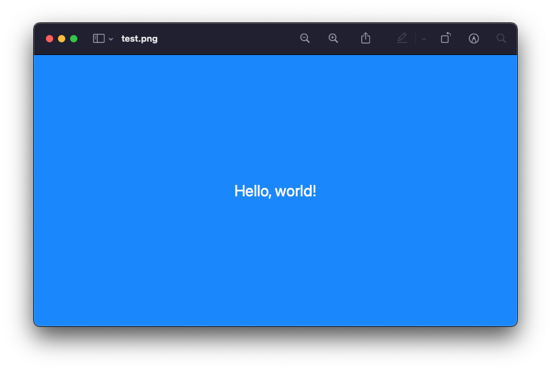

# ConsoleUI

Demo repository to showcase how to **programmatically generate images from a command-line tool with [SwiftUI](https://developer.apple.com/xcode/swiftui/)**.


## The Basics: Hello, world!

### Create a new command-line executable

```
$ mkdir mytool && cd mytool
$ swift package init --type executable
$ swift run
Hello, world!
```

### Generate Xcode 11 project

```
$ swift package generate-xcodeproj
$ open mytool.xcodeproj
```

### Add SwiftUI view

Create a view with a red label over white background

```swift
import SwiftUI

struct MySwiftUIView : View {
    var body: some View {
        ZStack {
            Color.white.edgesIgnoringSafeArea(.all)
            Text("Hello, world!").color(.red).font(.largeTitle)
        }
    }
}

#if DEBUG
struct MySwiftUIView_Previews : PreviewProvider {
    static var previews: some View {
        MySwiftUIView()
    }
}
#endif
```


### Rasterize view and save to file

We will use this method to rasterize views to images:

```swift
func rasterize(view: NSView, format: NSBitmapImageRep.FileType) -> Data? {
    guard let bitmapRepresentation = view.bitmapImageRepForCachingDisplay(in: view.bounds) else {
        return nil
    }
    bitmapRepresentation.size = view.bounds.size
    view.cacheDisplay(in: view.bounds, to: bitmapRepresentation)
    return bitmapRepresentation.representation(using: format, properties: [:])
}
```

The following code instantiates the SwiftUI view, wrapped inside a `NSHostingView` which is then
rasterized and saved to disk

```swift
let wrapper = NSHostingView(rootView: MySwiftUIView())
wrapper.frame = CGRect(x: 0, y: 0, width: 800, height: 450)

let png = rasterize(view: wrapper, format: .png)
try png?.write(to: URL(fileURLWithPath: "test.png"))
```


### Run the command and open in Preview

```
$ swift run && open test.png
```


